                              

# BITISAN开源数字货币、永续合约交易系统
BIZZAN-币严全新升级版

### 唯一演示地址： www.bitisan.org

- 测试环境仅供学习参考！！！请各位学习的小伙伴合理运用。
- 测试环境地址: 
https://www.bitisan.org 账户：13100031000 密码：123456 
https://admin.bitisan.org 账户：test 密码：123456 
- ## [English](README.md)
## 项目介绍：
- BITISAN 旨在打造一家领先的数字资产交易所，为全球用户提供安全、高效、创新的金融服务。作为一家交易平台，我们注重用户隐私和资产安全，采用最先进的区块链技术，为用户提供更快、更便捷的交易体验。

- BITISAN 交易所将支持多种数字资产的交易，涵盖加密货币、代币化资产以及其他数字化资产。我们拥有币币兑换、永续合约、期权合约、秒合约以及创新理财等市场上前沿的功能，我们致力于为投资者提供多元化的投资选择，推动数字资产的创新与发展。
在合规方面，我们将积极配合全球金融监管，建立健全的法规框架，确保平台的合规运营。我们追求公正透明的市场环境，维护投资者的权益，为市场参与者提供稳定可靠的交易平台。
通过不断优化和创新，我们的愿景是成为全球领先的数字资产交易平台，为用户创造更多价值，推动金融科技的进步，促进数字经济的可持续发展。

## 商业版演示图

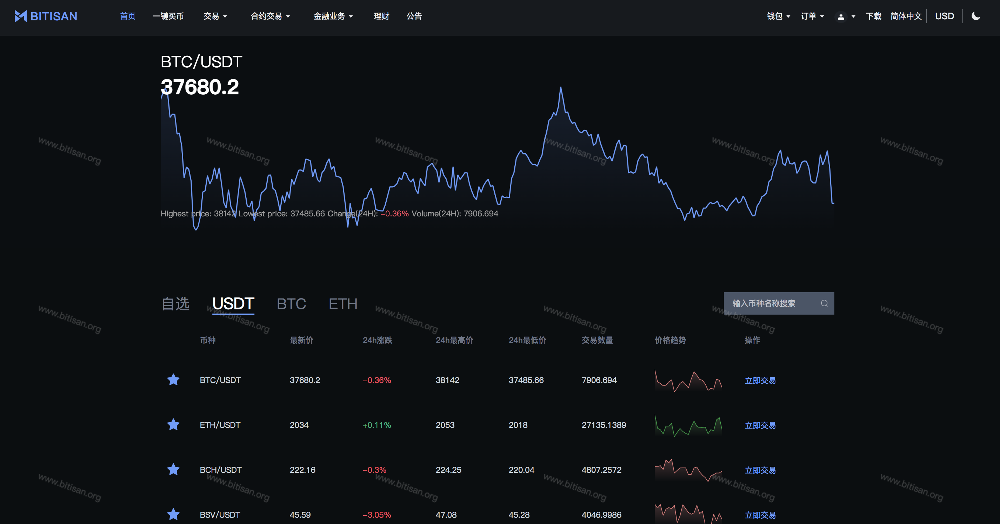
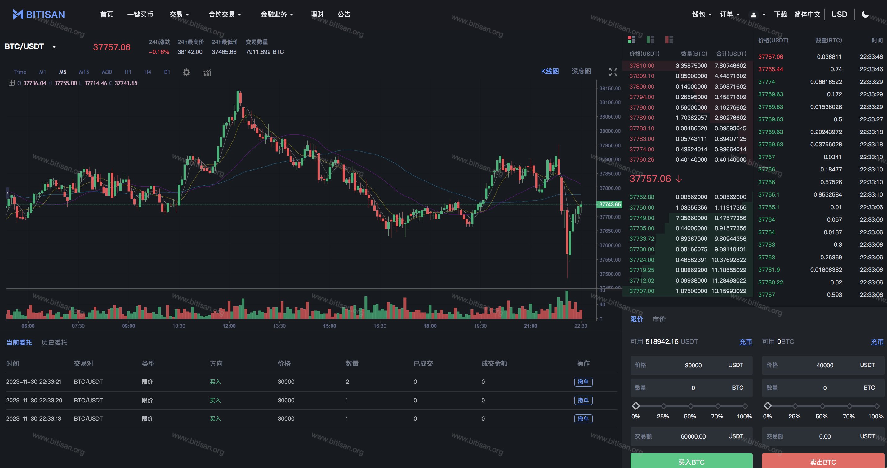
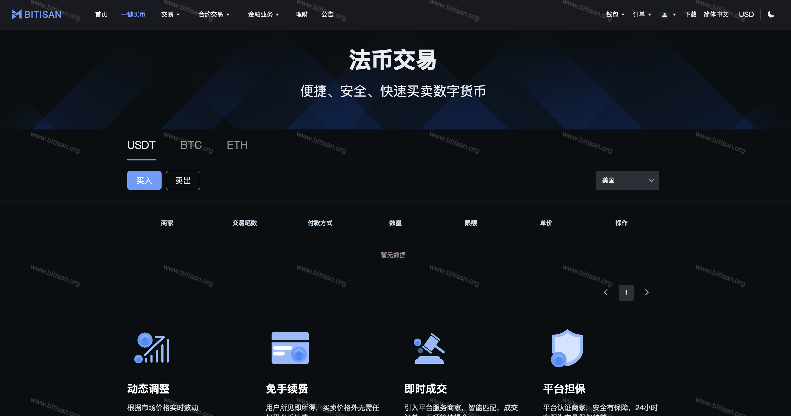
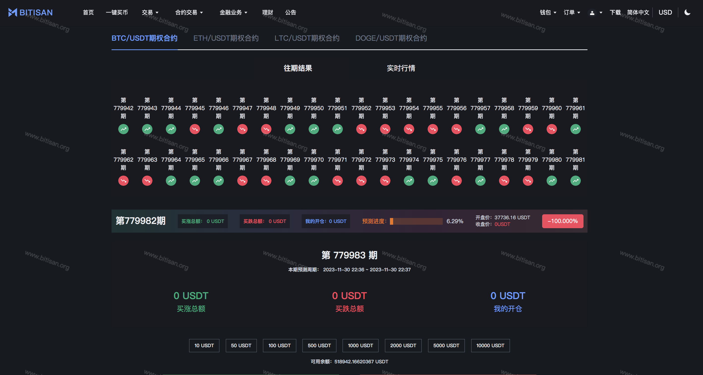
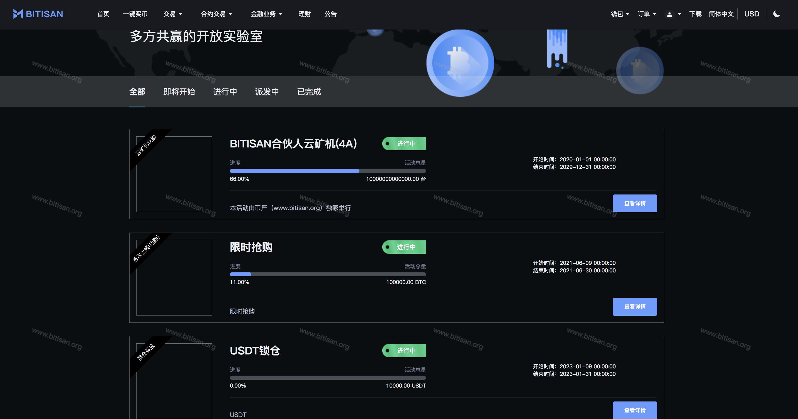
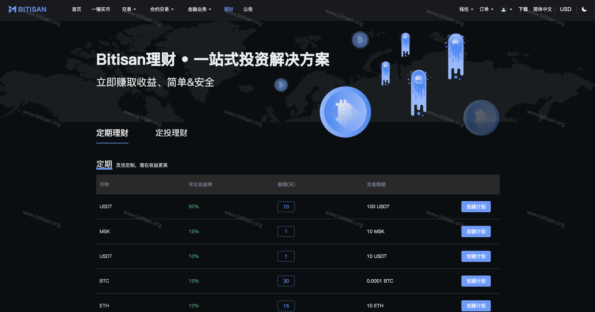
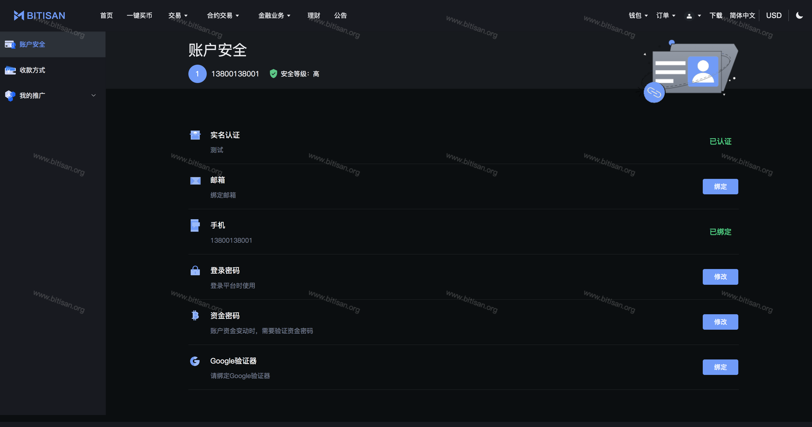
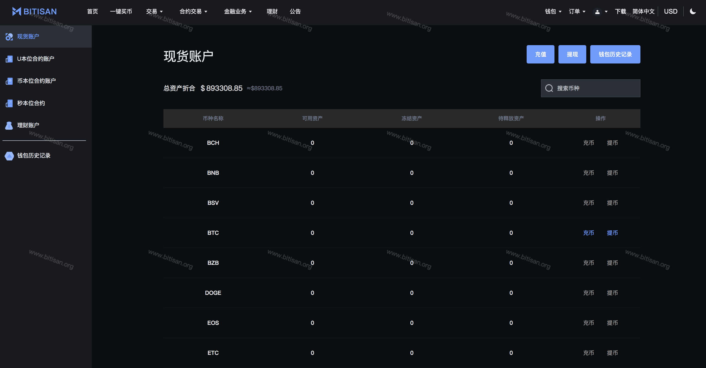
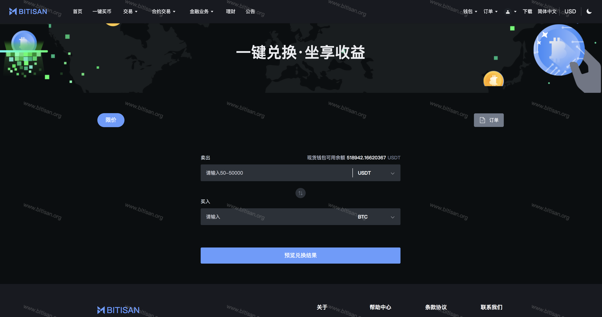

## 后台管理演示图
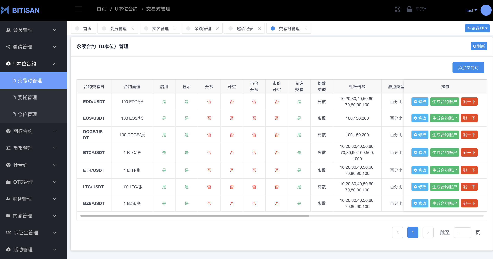
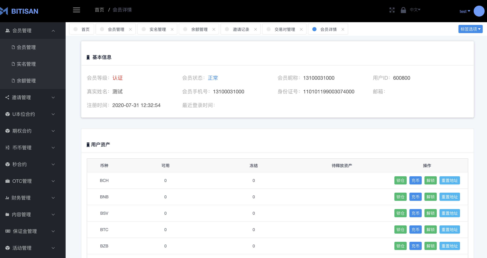
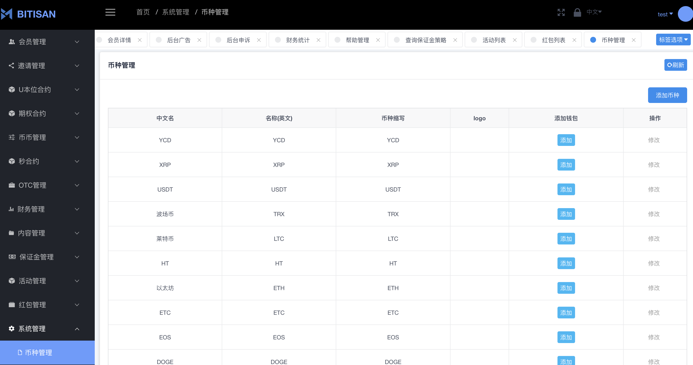
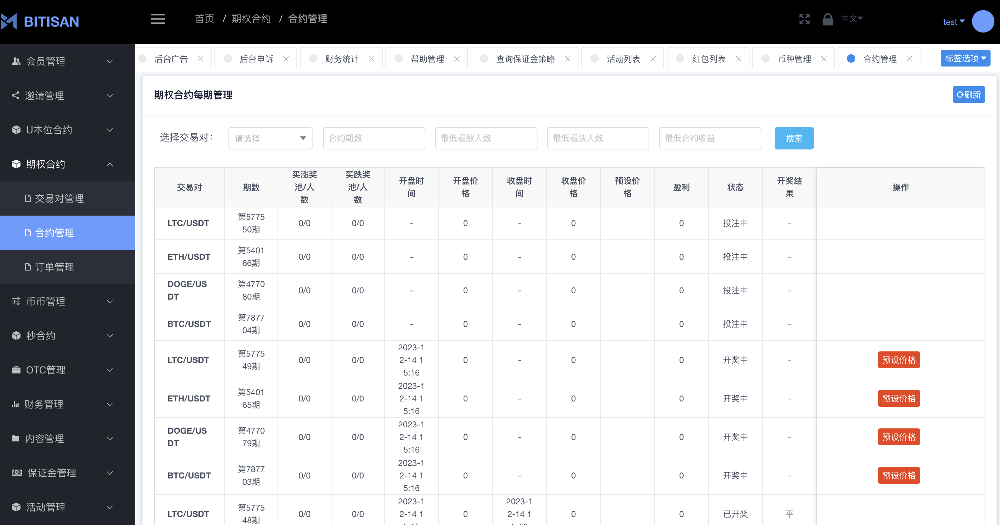

## 温馨提示：

- 最近有不法分子，通过我们开源的项目进行倒卖，请大家擦了眼睛，不要上当受骗，注意防范虚假宣传和不实信息！

- 任何使用本源码从事商业活动，对别人和自己造成损失的，本人概不负责！

- 本源码仅限于交流学习，凡涉及到法律问题与本人无关！

## 提问和建议

- 使用 Issuse，我们会及时跟进解答。
- Twitter：https://twitter.com/bitisan
- Telegram：https://t.me/bitisanex
- Telegram商务：https://t.me/bitisanop
- E-mail：bitisanop@gmail.com
- QQ：3801661902(bitisanop)

# 捐赠：

- 您的捐赠是我们开源最大的动力

- ETH：0x4056faa5d48be568353F96D6BE6A836Ef96E2cA1
- TRX：TEsVeyux3QF8REzMgv7iDht3GnD5nSrvEm
- BNB：0x4056faa5d48be568353F96D6BE6A836Ef96E2cA1
- Arbitrum：0x4056faa5d48be568353F96D6BE6A836Ef96E2cA1

## 警告：(FBI Warning)

##### 风险提示

1. 法定货币风险：
数字资产不是法定货币，其价值可能受到极大波动。投资者应当理性看待数字资产价格的变动，并注意市场风险。

2. 监管合规：
数字资产交易存在合规风险，不同平台可能面临监管政策的变化。投资者应选择合规的平台，了解并遵守相关法规，以保障自身权益。

3. 投资风险：
数字资产市场具有高度波动性，投资者可能面临资产损失的风险。在参与交易前，请仔细评估自身风险承受能力，并做好风险管理。

4. 非法平台警示：
提醒投资者远离未经授权或存在违法行为的数字资产平台，以防止遭受不法侵害。

5. 投资知识：
数字资产交易需要具备一定的投资知识，投资者应当不断学习，提高自身风险识别和应对能力。

6. 个人信息保护：
在选择数字资产交易平台时，注意平台对个人信息的保护措施，防范个人信息泄露风险。

7. 虚假宣传：
注意防范虚假宣传和不实信息，避免受到虚假交易平台的误导。

8. 资金安全：
保障资金安全是投资者的首要任务，选择有声誉、安全性高的数字资产交易平台进行交易。

9. 如果你想使用 BITISAN 作为商业应用，最好请个律师，确保你的商业应用在法律允许的范围内。一切用于商业化项目所带来的法律和经济问题，BITISAN 团队概不负责。

##### 提供技术服务并不是一件容易的事情。

- BITISAN 框架可以使你很容易的建立一套数字货币交易系统，但是，她远远比搭建一个网站要难的多得多.不要以为简单的就是点击下一步，下一步即可完成。整个体系架构分为了很多的组件，需要专业的知识或者团队才能运行成功，好在有我们，可以随时联系我们。

##### 你需要知道的基本知识

- 法律知识（安全第一条，法律最重要） 
- Java 知识（主要是 spring） 
- linux 知识（CentOS、Ubuntu 等等） 
- 前端（React，Vue，Java） 
- 其他安全知识等等

##### 主要技术

- 后端：Spring、SpringMVC、SpringData、SpringCloud、SpringBoot 
- 数据库：Mysql、Mongodb 
- 其他：redis、rocketMq、阿里云 OSS、腾讯防水校验、环信推送 
- 前端：Vue、uniApp、Swift(ios)、Java(android) 

## 加入我们：

- Twitter：https://twitter.com/bitisan 
- Telegram：https://t.me/bitisanex 
- Telegram商务：https://t.me/bitisanop 
- E-mail：bitisanop@gmail.com 

## 整体架构
#### 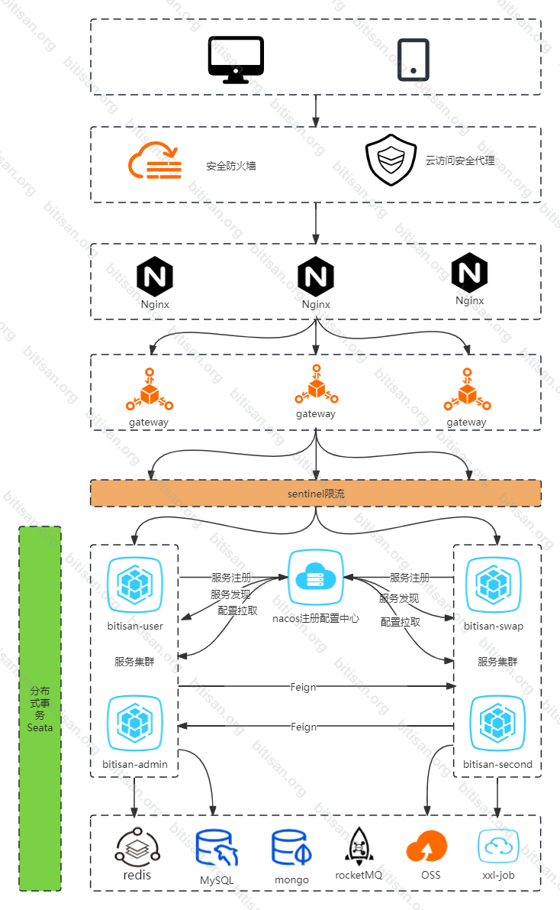

## 逻辑架构

#### 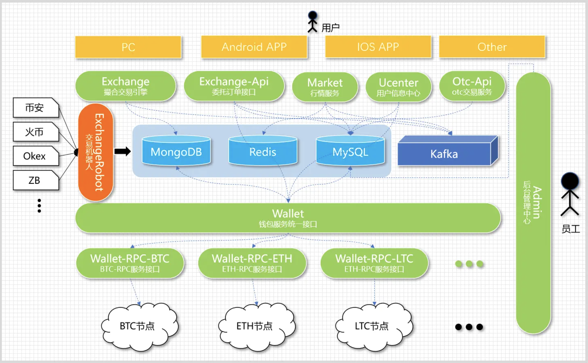

## 部署架构

#### 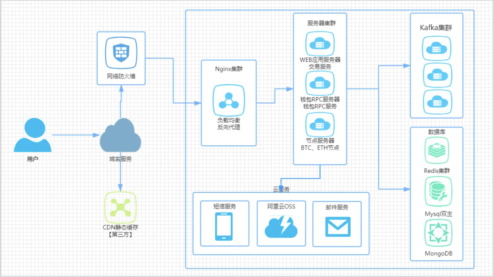

## 依赖关系

#### 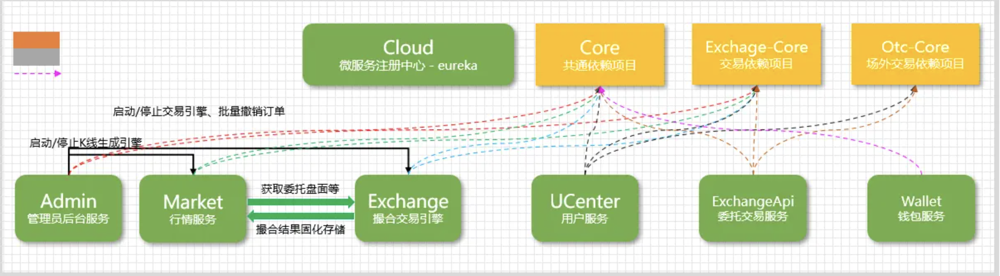

## 环境搭建

- Centos 7.6+
- MySQL 5.7.16+
- Redis 6.2.7
- Mongodb 4.0+
- rocketMq 4.4.0
- nginx-1.16.0+
- JRE 8u241
- JDK 1.8
- Vue

